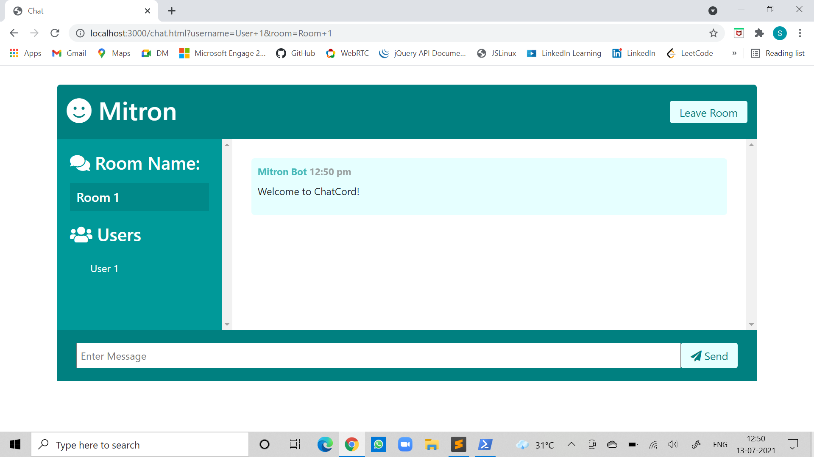

<h1 align="center">Welcome to Mitron 👋</h1>

> A web application to connect atmost 5 users for a video-call or multiple users for a chat-room

## Application is hosted on 
<a href="https://mitron-videochatapp.herokuapp.com" target="_blank">
   https://mitron-videochatapp.herokuapp.com
</a>

## Watch the video @
<a href="https://drive.google.com/file/d/18pWIiR_8tA3Of_do-Wk5w4M2eARb9YHq/view?usp=sharing" target="_blank">
    https://drive.google.com/file/d/18pWIiR_8tA3Of_do-Wk5w4M2eARb9YHq/view?usp=sharing
</a>

## UI  
### [Login Page](#)

### [Home Page](#)

### [Meeting Room](#)

### [Chatroom Page](#)

### [Chat Page](#)

## 👧 Contributors 👦

<table>
<tr align="center">

<td>
Sanya Tiwari
 

</td>

</tr>
</table>
